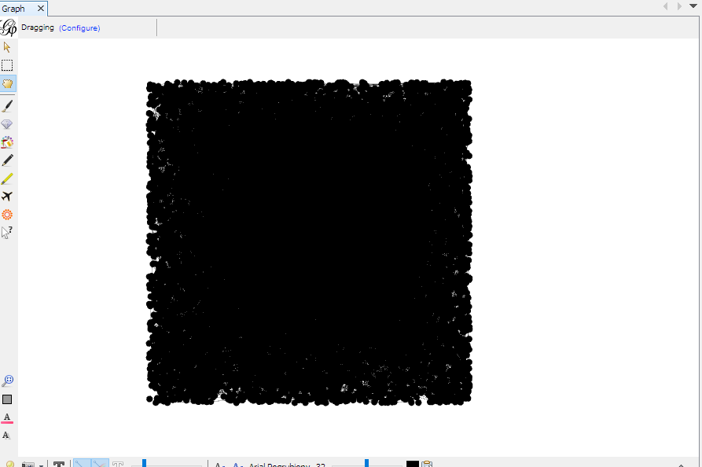
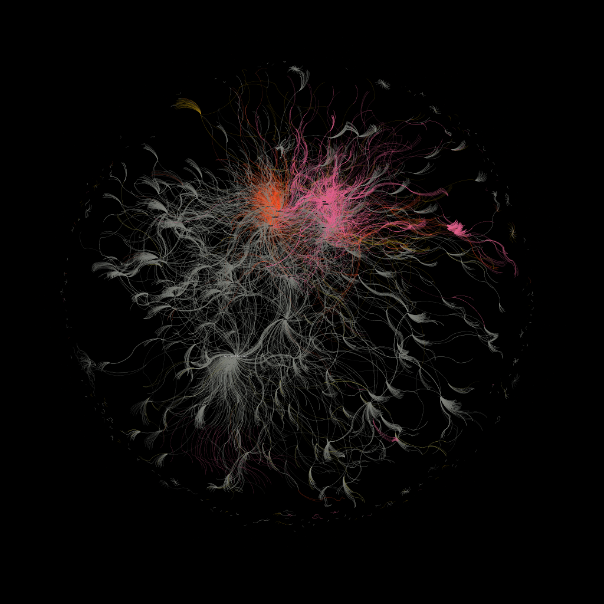
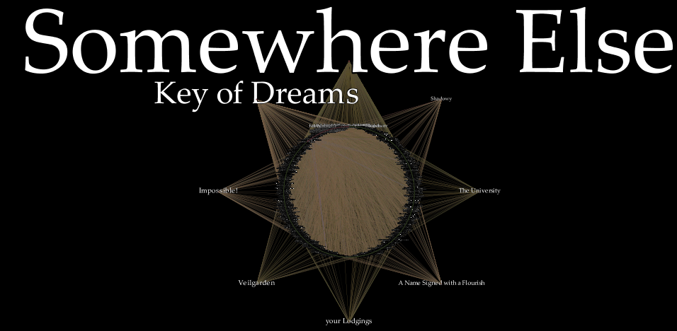
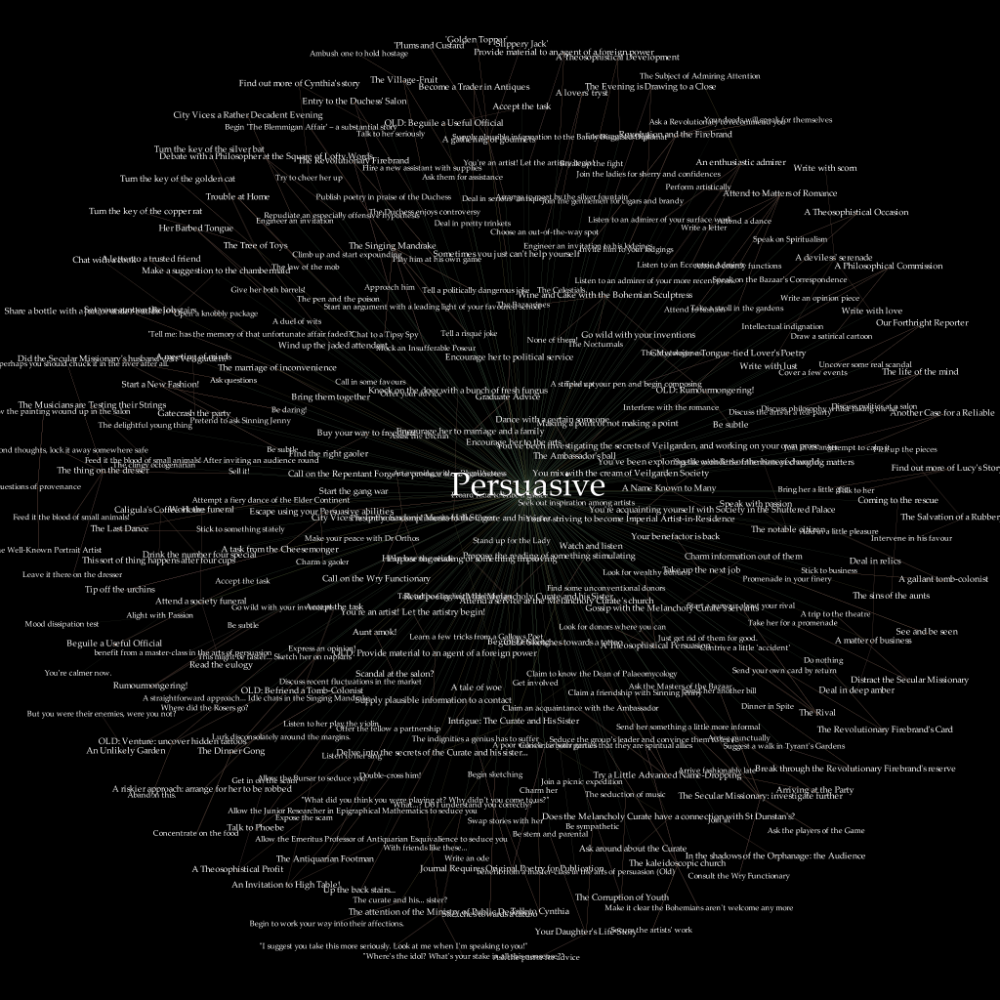
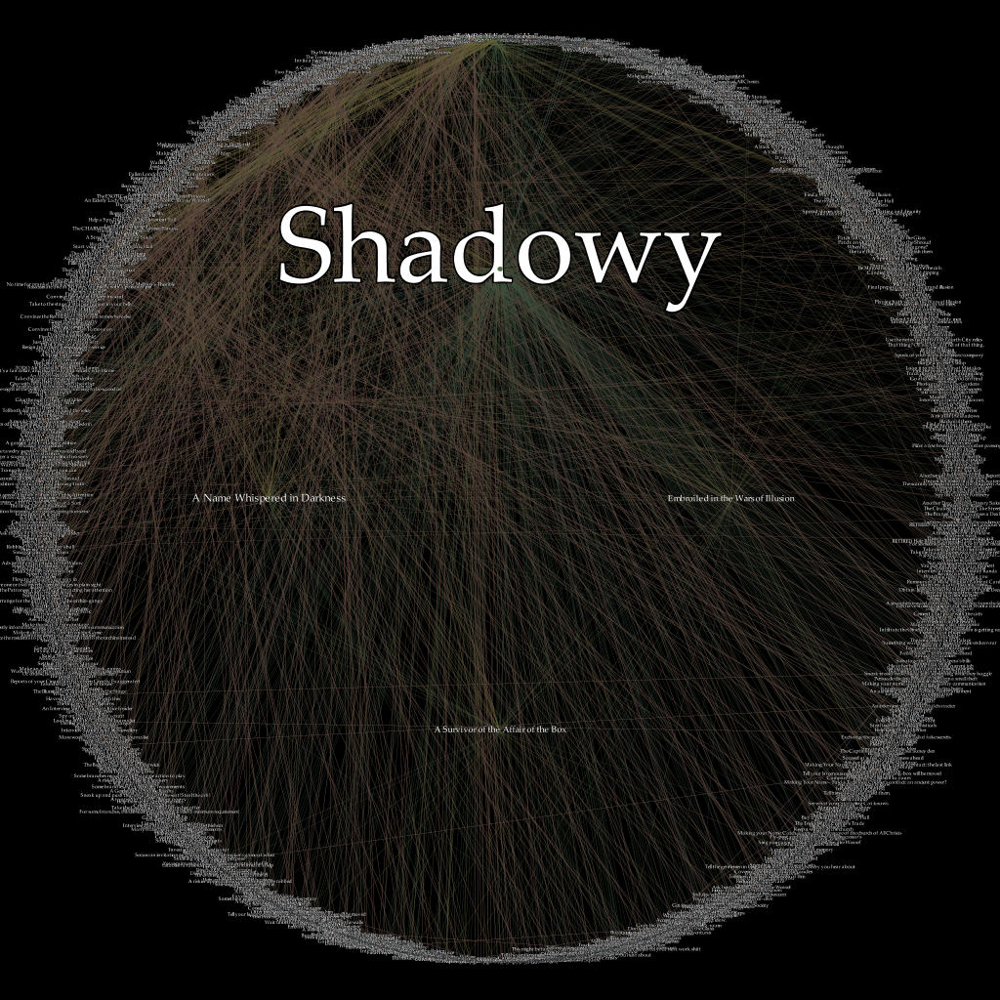
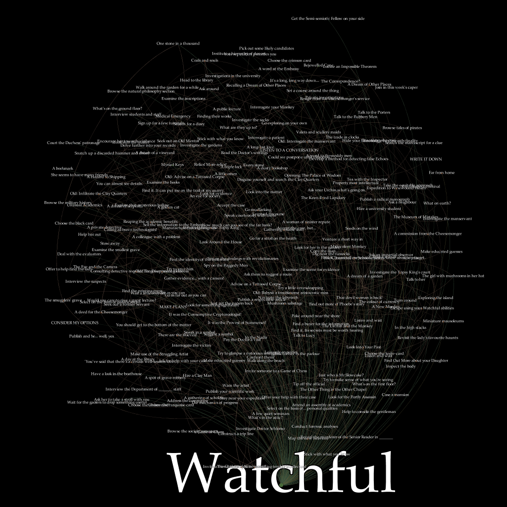
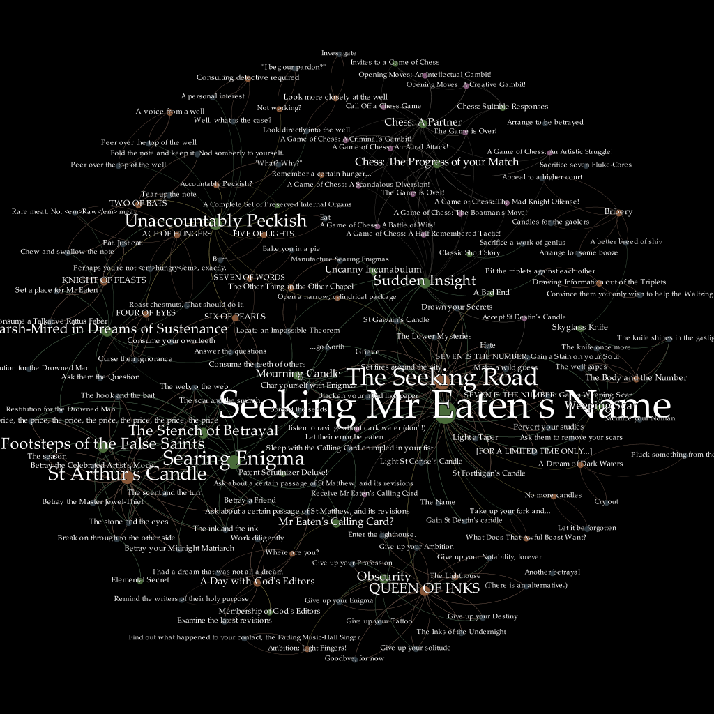
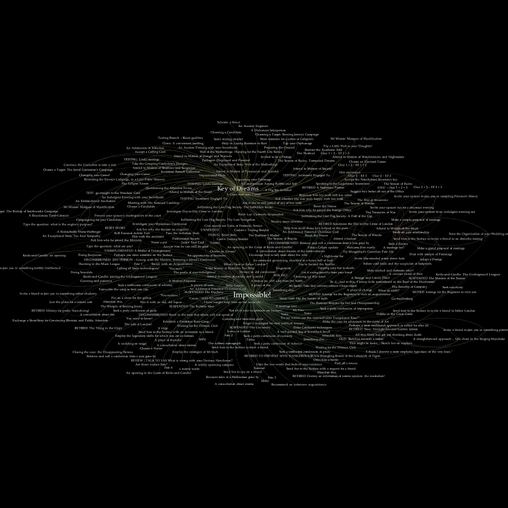
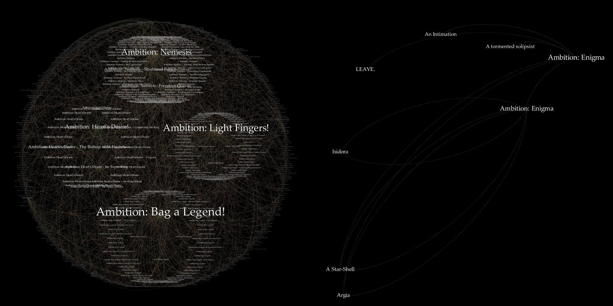

```
7MMF'                                 `7MM                        
  MM                                     MM                        
  MM         ,pW"Wq.  `7MMpMMMb.    ,M""bMM   ,pW"Wq.  `7MMpMMMb.  
  MM        6W'   `Wb   MM    MM  ,AP    MM  6W'   `Wb   MM    MM  
  MM      , 8M     M8   MM    MM  8MI    MM  8M     M8   MM    MM  
  MM     ,M YA.   ,A9   MM    MM  `Mb    MM  YA.   ,A9   MM    MM  
.JMMmmmmMMM  `Ybmd9'  .JMML  JMML. `Wbmd"MML. `Ybmd9'  .JMML  JMML.

             ----------------------
             |&&&&&&&&&&&&&&&&&&&&|
             |&&&&&&&&&&&&/.     *|
             |@@@&&&&&&&&&&@@@&*.%|
             |@@@@@@@@@@@@@@@@@@#.|
             |@@@@@@@@@@@@@@@@#.. |
             |@@@@@@@@@@@@@@@@#.. |
             |&@@@@@@@@@@@@@@@@@#.|
       /----&(&@@@@@@@@@@@@@@@@@,@&----\  
      @&&&&&&&&&&&& &&&&&&&& &&&&&&&&&&&@                         Fallen London
     (%&&&&&&&&&&& ' &&&&&& ' &&&&&&&&&&&)          Reverse Engineering Project
      @&&&&&&&&&&&   &&&&&&   &&&&&&&&&&@
       \-------------------------------/  
               \                */        
                \  / v v v v.\  /
                 \/           \/
                 
              ,,            ,,                  
`7MM\"""Mq.    db            db                                     
  MM   `MM.                                                        
  MM   ,M9  `7MM  ,pP"Ybd `7MM  `7MMpMMMb.   .P"Ybmmm              
  MMmmdM9     MM  8I   `"   MM    MM    MM  :MI  I8                
  MM  YM.     MM  `YMMMa.   MM    MM    MM   WmmmP"                
  MM   `Mb.   MM  L.   I8   MM    MM    MM  8M                     
.JMML. .JMM..JMML.M9mmmP' .JMML..JMML  JMML. YMMMMMb               
                                            6'     dP              
                                            Ybmmmd'     
```

# Introduction

Can it be true? All the world's knowledge, all the secrets - but no
sacrifice required? Can everything about your existence and all your
possible existences be deciphered from the inhuman languages and their
Words-Behind-Worlds? Is that dusty old tome the real Reverse Engineer's
Journal - and if it is, is it as powerful as they claimed? And perhaps
most importantly: what is the real price of such power?

+ **Shadowy** is increasing...
+ **Watchful** is increasing...
+ You've gained 1x **Reverse Engineer's Journal**
+ You've gained ∞ **Fate**!
+ A twist in your tale! You are now **A Scholar of Words-Behind-Worlds**

# Actual Introduction

Fallen London is a text-based browser MMO. It is set in a very
interesting world and its writing might be among the best in gaming.
Unfortunately, it is a browser MMO so all that good stuff is locked
behind both microtransaction paywalls and endless hours of grinding.
For a more detailed analysis of the game (and other titles set in
the same world), feel free to read
[an article](https://hg101.kontek.net/fallenlondon/fallenlondon.htm)
that I've written for Hardcore Gaming 101 (#TODO: link to a new HG101
site when they migrate that article).

Fortunately for us, we don't have to play the boring game of Fallen
London to learn the interesting story of Fallen London. Instead, we can
play a much more interesting game of reverse engineering.

We have talked a bit about this project with Failbetter Games and came
to an agreement that it would be better not to reveal some of the more
technical details about our findings as we don't want to enable cheating
and piracy of Fate-locked (i.e. paid) content. If you want an in-universe
explanation, let's say that you were unable to acquire a copy of
**Reverse Engineer's Journal** before Ministry of Public Decency found it.

# Graphing the Neath

## From JSON-in-SQLite to NetworkX to GEXF

The decrypted database contains more or less the entire design of
the game. There's just one problem with that: we have no convenient way
of exploring it. Sure, we have a readable SQLite - but the game data
isn't really described in a relational way so it's not very useful. You
see, there are no foreign keys here. It's JSONs with ID fields that
refer to ID fields of other JSONs when they want to make a reference.
It's like a second database inside the first one.

Speaking of references, there are a lot of those. Most of the in-game
objects contain, are contained by or in other ways connect to other
objects. One-to-one, one-to-many and many-to-many relations all exist in
here - and to understand what's going on, we need a way to easily follow
the links. Pulling the 'internal database', figuring out its structure
and turning into actual, well-designed relational DB might be a good
idea if we wanted to make our own version of the game and cared about
performance but such a structure would be quite tedious to explore
interactively as we attempt to untangle Fallen London's narrative.

Given that Fallen London can be thought of as a hypertext game,
a natural representation might be **H**yper**t**ext **M**arkup
**L**anguage. I of course reject this perfectly sane solution because
I'd like something easier to manipulate in an automated fashion
(the dataset is big so we want to reduce the tedium as much as
possible).

Because Fallen London can be thought of as a hypertext, a hypertext can
be thought of as a graph and JSONs in the database can be thought of as
a second database, my first thought is to use a graph database like
Neo4J. Unfortunately, there seems to be no Neo4J (or similar) equivalent
to SQLite that can be stored in a single file. They all need to be set
up as a server, which I feel is just not worth the trouble as it more or
less guarantees that nobody reading this will want to waste time on
that - and what good is a reversing writeup if the readers can't be
bothered to follow it?

In what in retrospect might not be such a good decision, I decide to
drop the 'database' part of 'graph database' and just store everything
as a graph that can be then accessed by graph exploration and network
analysis software. I use the NetworkX library to represent game data as
nodes and edges, write the fl_types module to tell it how to convert
different types of game objects and then dump the output to GEXF format
(it's based on XML because of course it is).

## Working with Gephi: the big graphs

I do a bit of research about open-source network analysis tools and go
for Gephi. It has a Python scripting plugin, it's
[aesthetic as hell](https://player.vimeo.com/video/9726202) and it has
already been used in some interesting narrative network analysis
projects - e.g. Andrew Beveridge's
[Network of Thrones](https://www.macalester.edu/~abeverid/thrones.html)
which used it to analyze the relations between the characters in A Song
Of Ice and Fire novel series. What could possibly go wrong?

Well, for the starters, Gephi just can't read my GEXF. It claims that
some node or edge ID is null, even though it isn't. Googling reveals
this to be
[a known problem for large files](https://github.com/gephi/gephi/issues/1841).
Because as of writing it haven't yet been fixed, I modify my scripts
a bit to ignore some objects and to treat some references as if they
were attributes, thus limiting the number of nodes and edges. This
works, and we're given this beautiful representation of game data:



I play around with colors a little bit (I color the nodes based on
partition->type, with a custom palette generated from
'Fancy (dark background)' preset), set the sizes of the nodes based on
their indegree, make the background black and then try to find a decent
layout. Unfortunately, most of the layouts either result in a huge mess
or take forever to generate - both of those problems arising due to
the size of my graph. Really, the only one that is even remotely useful
here is 'Open Ord'.

I also make labels for each node based on the 'Name' attribute (if you
have Gephi scripting plugin installed,
[there's a script for that](gephi_scripts/generate_labels.py))
and scale their size based on indegree. I display them in
a nice Palatino font (I think Failbetter uses Adobe's Trajan Pro 3 but
I don't have money for it). Unfortunately, you can't really see much of
the text in this image - but if you look hard enough, you'll see
the words 'Key of Dreams'. That's a quality which
[only the developer accounts have](http://community.failbettergames.com/topic21866-what-is-the-key-of-dreams.aspx),
and setting it as a required quality for something blocks it for normal
users. This means that there's a lot of such locked content in the game
(other quality used for locking is 'Impossible'; it's also required for
a lot of things).



After trimming the graph a little bit (I removed things which don't have
a 'type' attribute - as they're result of some kind of a bug - with
Filters->Library->Attributes->Non-null->type (Attribute); I also removed
things that are not connected to the main graph with
Filters->Library->Topology->Giant Component). Then, I used the Dual
Circle layout, made 8 upper order nodes based on the indegree and placed
them outside of the main circle. This gave us this cool-looking star:



As you see, the locations ('Somewhere else', 'Veilgarden',
'your Lodgings', 'The University') are connected to many other things.
In subsequent analysis, this made isolating graphs for specific
questlines in an automated way difficult so I modified a script to
ignore them so that most edges would connect events and qualities.

## Using modularity to find related content

Calculating modularity is one of the methods of (non-overlapping)
community detection. Nodes within those communities will be densely
connected with each other but sparsely connected to the rest of
the graph. As a result, a graph will be effectively divided into
subgraphs.

Modularity is useful to us: a group of interconnected events, qualities,
branches etc. is highly indicative of a discrete storyline.
Unfortunately, this isn't so simple in practice: the algorithm tends to
create both large communities that would be better off split up into
smaller sections and micro-communities of 2 or 3 nodes that don't tell
us much. Finding desired results will require a lot of manual tweaking.

To run the algorithm, use Statistics->Network Overview->Modularity. You
can then filter the graph by detected community with
Filters->Library->Attributes->Partition->Modularity Class.

With the modularity algorithm, we can find content related to our
playable character's main stats. This is nice, but it also reveals how
the presence of such 'popular' vertices distorts our results a bit:
'those things are all related to your persuasion skill' is a very broad
strokes connection when this skill is connected to (more or less) one
fourth of the game's content.








But, as I said, with a bit of tweaking, you can find what you're looking
for. Here's a graph representing the game's infamously difficult quest
called 'Seeking Mr Eaten's Name'. We're digging into the game's secrets
here: this is basically Fallen London's endgame, and very few players
have finished it.



Keep in mind that the modularity algorithm is just a heuristic: while
most of the things you see here are related to SMEN, I don't think that,
for example, 'A Game of Chess' (one of the game's sort-of-PVP
components) has anything to do with it.

## Ego networks/Neighborhood networks

Ego network consist of a vertice, all the vertices connected directly
to it and all the edges between them. This is obviously a good way to
show things around a central node. You can find the node's ego network
in Gephi with Filters->Library->Topology->Ego Network and inputting its
ID, and if you want to make an ego network for a group of nodes that
you've filtered then drag Filters->Library->Topology->Neighborhood
Network into its subfilters.

In game terms, this is useful for finding stuff related to a specific
quality. For example, we can get all the choices that aren't accessible
to the players by making ego networks for 'Impossible!' and 'Key
of Dreams' qualities.



## Ambitions: the final boss of Fallen London RE graphs

It is said that a well designed final boss fight is like a final exam,
testing everything you've learned while playing the game. In the game of
reverse engineering Fallen London into cool-looking graphs, we're going
to make the ultimate cool-looking graph with our knowledge of Gephi
layouts, filters, modularity and ego networks. Ladies and gentlemen,
it's time for Ambitions!

In Fallen London, Ambitions can be though of as 'main quests'. They last
a really long time, finishing them requires grinding related stats to
quite a high level (or it would if they were actually possible to
complete; as of writing, they're still unfinished), they can have
discrete subquests and you can only have one active at the same time.

There are four ambitions in the game: Nemesis, Heart's Desire, Light
Fingers and Bag a Legend. Due to their size, they connect to a lot of
things, but there's one thing that makes working with them easier:
qualities related to your main quest progress have titles like
'Ambition: [ambition name]', or
'Ambition: [ambition name] - [subtitle]'. This means that we can match
them with simple filters: Filters->Library->Attributes->Equals->Name
with values defined as 'Ambition: Nemesis.\*', 'Ambition: Heart.\*',
'Ambition: Light.\*' and 'Ambition: Bag.\*' and the box that turns
value to regex ticked. Now we can drop the Neighborhood Network into our
subfilter and we're good to go.

Well, we would be, if I didn't lie about one thing. You know, there's
actually five ambitions. The last one is another one of the game's
secrets. It's called 'Ambition: Enigma' and it works in a completely
different way from other ambitions. It's very short, it's hidden behind
some Invisible Cities references (or rather 'Invisible Cities references
that are more explicit than the usual Invisible Cities references in
Fallen London') and it's less about the world of the game and more about
the game itself. So we need just one more ego network, but this is
trivial to create.

Now that we have a subgraph of all the ambition-related content, it's
time to make it look cool. First of all, we create filters for
qualities that track the progress of main quests. This works just like
the filters in the above paragraph, but without Neighborhood Networks
around them. We also make a filter for things that are not qualities
that track progress directly: we need Filters->Library->Operator->NOT,
with Filters->Library->Operator->UNION as its subfilter, and then we
duplicate all the other filters and drop them as subfilters to that one.

Unfortunately, this doesn't work too well for Enigma, as it's just two
nodes called 'Ambition: Enigma' now. Fortunately, we can approach it
differently. Because of its small size and the fact that it's not
connected to anything else, we can easily find a modularity which
includes the whole thing. We do it, and update the NOT filter
accordingly.

What follows is more art than science as I try to make the best-looking
graph I can. The four inner circles are four ambitions, the outer circle
is parts of their ego networks that don't track the quest progress
directly, and that spiral outside of the main graph is Enigma.



# Additional thoughts

+ I found some things about Gephi really annoying: it couldn't read
large files, it sometimes corrupted its workspace (which meant that I
had to start over because I couldn't open it); I don't want to be too
critical about it because I don't think that the output of my scripts
is anything like the data that is usually fed to Gephi, but I want to
warn you: following my path will lead to a lot of annoyance
+ While I don't want to be too critical about Gephi itself, I am going
to be extremely critical about its scripting console plugin; a lot
of the features described in
the [tutorial](https://github.com/gephi/gephi/wiki/Scripting-Plugin)
(filter syntax, accessing graph node attributes like Python object
attributes etc.) just don't seem to work
+ When I found an interesting subgraph, I went into Data Explorer
to read the descriptions - this worked but it wasn't very convenient;
if I went the HTML generation route, reading would be convenient because
I'd just use browser for it, but finding interesting content would be
a pain in the ass; a decent compromise would be using the scripting
console to generate HTMLs from filtered subgraphs, but the problem is
that the scripting console sucks; I might do it if I'm bored though
+ Maybe using a graph database would allow me to avoid some of
the annoyances I'm describing right now - I need to experiment with
Neo4J
+ I don't think anyone did something like that before - using graphs to
reverse engineer a hypertext game (I might be wrong; feel free to send
me examples of people doing that); despite the annoyances, I think it's
really interesting and I'm planning to do something like that in
the future; I'll probably try reversing *80 Days*, another British
hypertext game with an alternate history Victorian setting
+ One thing that was always on the back of my head when doing this:
Prolog; while I think that the exact things I was doing in this project
(communities, ego networks, visualizations, interactive exploration) are
better served by graph-specific tools, I do think that logic programming
might also be useful in reversing hypertext games - maybe for generating
'walkthroughs' from game data (especially if desired outcome depends not
just on going from one vertice to another but also on some conditions
held in variables); maybe I'll do something about logic programming
for hypertext RE

# Authors

London Rising was brought to you by
[Maciej Miszczyk](https://github.com/mmiszczyk) and
[Mateusz Lindenberg](https://github.com/Lindeed). Of course, it wouldn't
be possible without Alexis Kennedy and Failbetter Games.

Special thanks to Adam Myers from Failbetter Games for talking to us
about things which can be brought to light and those that should
remain secret.

# License

```
This program is free software; you can redistribute it and/or modify
it under the terms of the GNU General Public License as published by
the Free Software Foundation; either version 2 of the License, or
(at your option) any later version.

This program is distributed in the hope that it will be useful,
but WITHOUT ANY WARRANTY; without even the implied warranty of
MERCHANTABILITY or FITNESS FOR A PARTICULAR PURPOSE.  See the
GNU General Public License for more details.

You should have received a copy of the GNU General Public License
along with this program; if not, write to the Free Software
Foundation, Inc., 51 Franklin St, Fifth Floor, Boston, MA  02110-1301  USA
```